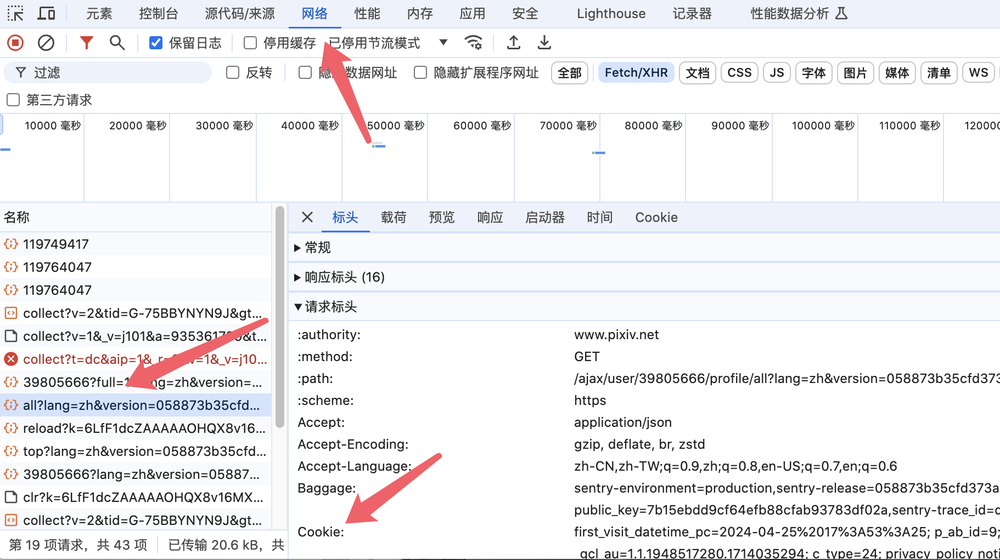
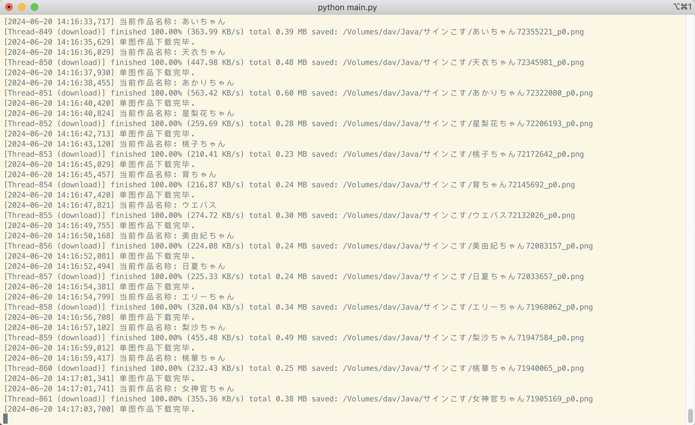

# Pixiv-web
基于网页api的 pixiv 下载工具

## 如何使用
1.  安装 python 3 (最好大于3.7以上)
2.  下载或者clone最新版本的源代码
3.  在项目根目录 安装依赖 `pip install -r requirements.txt`
4.  运行 `python main.py `
5.  如果无法登录的话可以手动配置token 教程如下:
   - 在登录的情况下进入 pixiv 任意界面
   - 找到如下图的token 复制到config.ini文件的User token中
   - 

## Example:
> 下载总有失败的时候 失败的记录会存入数据库 调用 errors_download 重新下载
```python
from pixiv import Pixiv

p = Pixiv()
# 下载单个作品
p.work_detail(10000022).download()
p.work_detail('https://www.pixiv.net/artworks/10000022').download()

p.set_proxy('http://127.0.0.1:1080')
# 获取所有关注的用户的所有作品
p.download_user_following()
# 重试下载因各种异常而失败的作品
p.errors_download()
# 订阅关注的用户的最新作品
p.subscribing()
# 下载用户所有作品
p.download_user_works(62286279)
# 下载收藏的所有作品
p.download_user_bookmarks_illust()
# 用户搜索
p.search_user('666', is_all=True)
# 搜索 水着  json_result.illustManga.data
json_result = p.search('水着')
print(json_result.illustManga.data)
# 关注用户的新作
result = p.bookmark_new_illust()
print(result['thumbnails']['illust'])
# 排名榜 今日r18 的插画 每次返回50条 可以使用返回的 'rank_total' 进行分页获取
res = p.illust_ranking('daily_r18', 'illust')
print(res.contents)
# 过取几天的搜索
res = p.illust_ranking('daily', 'manga', '20240621')
print(res.contents)
```

## config.ini说明
***
```yaml
[User]
token = 

[Network]
# 用户的代理 默认不启用
use_proxy = 
# 同时下载的进程数
max_concurrent_threads = 5
# 失败了重试几次?
stop_max_attempt_number = 2
# 重试间隔?秒
wait_fixed = 2

[Settings]
# 下载到哪
root = 
# 数据库文件位置
db_path = 
# 连续下载阈值
max_sleep_counter = 120
# 连续下载后休眠?秒
sleep = 60
# 是否覆盖下载 默认False 不覆盖
is_repeat = False
# 文件名格式 具体有哪些 继续往下看
illust_file_name = {user}/{title}{id}
manga_file_name = {user}/{title}{id}
series_manga_file_name = {user}/{series_title}/#{series_order} {title}{id}
# 不想下载的用户id 多个,分割
skip_user = 
# 是否过滤名称中的特殊字符
is_filter_name = yes

```

## 文件名规则
>可以使用 '/' 建立文件夹。示例： {user}/{id}
为了防止文件名重复，命名规则里一定要包含 {id} 或者 {id_num}{p_num}。
您可以使用多个标记；建议在不同标记之间添加分割用的字符。示例：{id}-{user_id}
> 
> >有些标记并不总是可用，有时它们可能什么都不输出。
> 
* {id} 默认文件名，如 44920385_p0
* {user} 用户名字
* {user_id} 用户 ID（数字）
* {title} 作品标题
* {tags} 作品的标签列表
* {page_title} 页面标题
* {type} 作品类型，分为：Illustration, Manga, Ugoira, Novel
* {AI} 如果作品是由 AI 生成的，则输出 AI
* {like} Like count，作品的点赞数。
* {bmk} Bookmark count，作品的收藏数。把它放在最前面可以让文件按收藏数排序。
* {bmk_id} Bookmark ID。你收藏的每一个作品都会有一个 Bookmark ID。收藏的时间越晚，Bookmark ID 就越大。当你下载你的收藏时，可以使用 {bmk_id} 作为排序依据。
* {view} View count，作品的浏览量。
* {rank} 作品在排行榜中的排名。如 #1、#2 …… 只能在排行榜页面中使用。
* {date} 作品的创建时间。如 2019-08-29。
* {upload_date} 作品内容最后一次被修改的时间。如 2019-08-30。
* {series_title} 系列标题，只在系列页面中可用（小说系列、漫画系列）。
* {series_order} 作品在系列中的序号，如 #1 #2。只在系列页面中可用（小说系列、漫画系列）。
* {series_id} 系列 ID，只在系列页面中可用（小说系列、漫画系列）。
* {id_num} 数字 ID，如 44920385


> 可自行调用Pixiv 类组合使用
>> 分页的limit不清晰的话可以参考函数的默认值 乱填的话会报错
## Pixiv-API
```python
class Pixiv:
    # 设置代理
    def set_proxy(self, proxy_hosts: str = "http://127.0.0.1:1080"):
        
    def user_detail(self, user_id: int | str):
        """
        用户详情
        :param user_id: 默认当前登录用户
        :return:
        """

    def user_works(self, user_id: int | str, _type: _TYPE = ''):
        """
        用户所有作品
        :param _type:  默认全部获取
        :param user_id:
        :return: 返回 插画 illusts 漫画 manga 漫画系列 mangaSeries
        """

    def work_detail(self, illust_id):
        """
        作品详情
        :param illust_id:
        :return:
        """

    def bookmark_new_illust(self, page: int | str = 1, mode="all"):
        """
        关注用户的新作  https://www.pixiv.net/bookmark_new_illust.php
        :param page: 分页
        :param mode: r18 | all
        :return:
        """

    def user_bookmark_tags(self):

    def user_bookmarks_illust(self,
                              tag: str = '',
                              offset: int | str = 0,
                              limit: int | str = 48,
                              restrict="show"
                              ):
        """
        用户收藏作品列表   https://www.pixiv.net/users/xxx/bookmarks/artworks
        :param tag: 从 user_bookmark_tags 获取的收藏标签
        :param offset: 分页偏移
        :param limit: 每页多少
        :param restrict:  show 公开 | hide 不公开
        :return:
        """

    def illust_comments(self, illust_id: int | str, offset: int | str = 0, limit: int | str = 3):
        """
        作品评论
        :param illust_id:
        :param offset:
        :param limit:
        :return:
        """

    def recommend_illusts(self, illust_ids: list):
        """
        推荐的作品列表
        :param illust_ids: 18个id [0, 1, 2, ...17]
        :return:
        """

    def illust_related(self, illust_id: int | str, limit: int | str = 18):
        """
        相关作品列表
        :param illust_id:
        :param limit:
        :return: 接口返回一页相关作品 illusts 和剩下的相关作品id nextIds 剩下的相关作品需要调用 recommend_illusts 获取
        """

    def illust_ranking(self,
                       mode: _MODE = '',
                       content: _CONTENT_TYPE = '',
                       date: str = '',
                       page: int | str = 1
                       ):
        """
        排行榜  https://www.pixiv.net/ranking.php
        :param mode:
        :param content:
        :param date: demo: 20240615
        :param page:
        :return:
        """

    def search_suggestion(self, mode: str = 'all'):
        """
        搜索建议数据
        :param mode:
        :return: myFavoriteTags 喜欢的标签   tagTranslation 标签翻译   recommendTags 人气插画标签
        """

    def search(self, word: str, url_type: _SEARCH_URL_TYPE = 'artworks', params: dict = None):
        """
        搜索
        :param word: 关键字
        :param url_type:
        :param params: 参数太多了 参考web api
        :return: 返回标签 插画 漫画 小说
        """

    def user_recommends(self,
                        user_id: int | str,
                        user_num: int | str = 20,
                        work_num: int | str = 3,
                        is_r18: bool = True):
        """
        根据某个用户 推荐类似的用户
        :param user_id:
        :param user_num:
        :param work_num:
        :param is_r18:
        :return: thumbnails 作品  recommendUsers 用户对应作品的id  users 推荐的用户
        """

    def user_following(self,
                       offset: int | str = 0,
                       limit: int | str = 24,
                       rest: str = 'show',
                       tag: str = '',
                       accepting_requests=0
                       ):
        """
        已关注的用户
        :param offset:
        :param limit:
        :param rest: hide 非公开 | show 公开
        :param tag:
        :param accepting_requests: 仅显示正在接稿的用户 0 1
        :return:
        """

    def user_follower(self,
                      offset: int | str = 0,
                      limit: int | str = 24,
                      ):
        """
        当前用户粉丝列表
        :param offset:
        :param limit:
        :return:
        """

    def user_mypixiv(self,
                     offset: int | str = 0,
                     limit: int | str = 24,
                     ):
        """
        好p友
        :param offset:
        :param limit:
        :return:
        """

    def ugoira_metadata(self, illust_id: int | str):
        """
        获取动图的数据
        :param illust_id:
        :return:
        """

    def illust_new(self,
                   lastId: int | str = 0,
                   limit: int | str = 20,
                   type: _TYPE = 'illust',
                   is_r18: bool = False,
                   ):
        """
        大家的新作   https://www.pixiv.net/new_illust.php
        :param lastId:
        :param limit:
        :param type:
        :param is_r18:
        :return:
        """

    def manga_series(self, serie_id: int | str, page: int | str):
        """
        漫画系列列表  https://www.pixiv.net/user/xxx/series/xxx
        :param serie_id:
        :param page:
        :return:
        """

    def download_work(self, illust):
        """
        下载作品 必须是 work_detail 返回的数据
        :param illust: work_detail返回的值
        :return:
        """

```

## 效果图


## License

MIT
