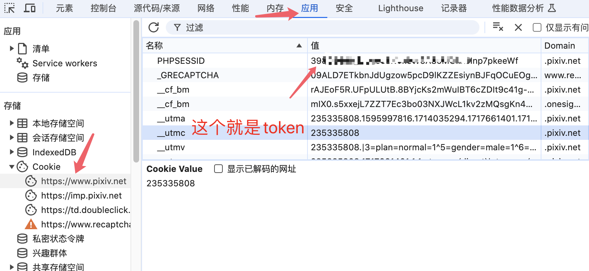

# Pixiv-web
基于 web api的pixiv 下载工具

## 如何使用
1.  安装 python 3 (最好大于3.7以上)
2.  下载或者clone最新版本的源代码
3.  在项目根目录 安装依赖 `pip install -r requirements.txt`
4.  运行 `python main.py ` 首次运行会在目录下生成config.ini 文件
5.  配置config.ini  需要从 https://www.pixiv.net 获取 cookie 和 id 教程如下:
   - 在登录的情况下进入 pixiv 首页 点击自己头像
   - 点击鼠标右键-> 检查 或者 按下键盘 F12 然后 -> 点击网络(Network) 刷新界面
   - 点击 Fetch/XHR 找个有cookie 的链接 然后复制 cookie 到配置文件
   - 查看网页url获取 自身id 填入config.ini
   - 

## Example:
```python
from pixiv import Pixiv

p = Pixiv()
# 获取所有关注的用户
res = p.user_following()
users = res.users
limit = 24
# 获取全部分页
for offset in range(24, res.total, limit):
    res = p.user_following(offset, limit)
    users.extend(res.users)

# 获取所有关注的用户的所有作品
p.download_user_following()
```

> 可自行调用Pixiv 类组合使用

## Pixiv-API
```python
class Pixiv:
    # 设置代理
    def set_proxy(self, proxy_hosts: str = "http://127.0.0.1:1080"):
        
    def user_detail(self, user_id: int | str):
        """
        用户详情
        :param user_id: 默认当前登录用户
        :return:
        """

    def user_works(self, user_id: int | str, _type: _TYPE = ''):
        """
        用户所有作品
        :param _type: all 全部获取
        :param user_id:
        :return: 返回 插画 illusts 漫画 manga 漫画系列 mangaSeries
        """

    def work_detail(self, illust_id):
        """
        作品详情
        :param illust_id:
        :return:
        """

    def work_follow(self, page: int | str = 1, mode="all"):
        """
        关注用户的新作  https://www.pixiv.net/bookmark_new_illust.php
        :param page: 分页
        :param mode: r18 | all
        :return:
        """

    def user_bookmark_tags(self):

    def user_bookmarks_illust(self,
                              tag: str = '',
                              offset: int | str = 0,
                              limit: int | str = 48,
                              restrict="show"
                              ):
        """
        用户收藏作品列表   https://www.pixiv.net/users/xxx/bookmarks/artworks
        :param tag: 从 user_bookmark_tags 获取的收藏标签
        :param offset: 分页偏移
        :param limit: 每页多少
        :param restrict:  show 公开 | hide 不公开
        :return:
        """

    def illust_comments(self, illust_id: int | str, offset: int | str = 0, limit: int | str = 3):
        """
        作品评论
        :param illust_id:
        :param offset:
        :param limit:
        :return:
        """

    def recommend_illusts(self, illust_ids: list):
        """
        推荐的作品列表
        :param illust_ids: 18个id [0, 1, 2, ...17]
        :return:
        """

    def illust_related(self, illust_id: int | str, limit: int | str = 18):
        """
        相关作品列表
        :param illust_id:
        :param limit:
        :return: 接口返回一页相关作品 illusts 和剩下的相关作品id nextIds 剩下的相关作品需要调用 recommend_illusts 获取
        """

    def illust_ranking(self,
                       mode: _MODE = '',
                       content: _CONTENT_TYPE = '',
                       date: str = '',
                       page: int | str = 1
                       ):
        """
        排行榜  https://www.pixiv.net/ranking.php
        :param mode:
        :param content:
        :param date: demo: 20240615
        :param page:
        :return:
        """

    def search_suggestion(self, mode: str = 'all'):
        """
        搜索建议数据
        :param mode:
        :return: myFavoriteTags 喜欢的标签   tagTranslation 标签翻译   recommendTags 人气插画标签
        """

    def search(self, word: str, url_type: _SEARCH_URL_TYPE = 'artworks', params: dict = None):
        """
        搜索
        :param word: 关键字
        :param url_type:
        :param params: 参数太多了 参考web api
        :return: 返回标签 插画 漫画 小说
        """

    def user_recommends(self,
                        user_id: int | str,
                        user_num: int | str = 20,
                        work_num: int | str = 3,
                        is_r18: bool = True):
        """
        根据某个用户 推荐类似的用户
        :param user_id:
        :param user_num:
        :param work_num:
        :param is_r18:
        :return: thumbnails 作品  recommendUsers 用户对应作品的id  users 推荐的用户
        """

    def user_following(self,
                       offset: int | str = 0,
                       limit: int | str = 24,
                       rest: str = 'show',
                       tag: str = '',
                       accepting_requests=0
                       ):
        """
        已关注的用户
        :param offset:
        :param limit:
        :param rest: hide 非公开 | show 公开
        :param tag:
        :param accepting_requests: 仅显示正在接稿的用户 0 1
        :return:
        """

    def user_follower(self,
                      offset: int | str = 0,
                      limit: int | str = 24,
                      ):
        """
        当前用户粉丝列表
        :param offset:
        :param limit:
        :return:
        """

    def user_mypixiv(self,
                     offset: int | str = 0,
                     limit: int | str = 24,
                     ):
        """
        好p友
        :param offset:
        :param limit:
        :return:
        """

    def ugoira_metadata(self, illust_id: int | str):
        """
        获取动图的数据
        :param illust_id:
        :return:
        """

    def illust_new(self,
                   lastId: int | str = 0,
                   limit: int | str = 20,
                   type: _TYPE = 'illust',
                   is_r18: bool = False,
                   ):
        """
        大家的新作   https://www.pixiv.net/new_illust.php
        :param lastId:
        :param limit:
        :param type:
        :param is_r18:
        :return:
        """

    def manga_series(self, serie_id: int | str, page: int | str):
        """
        漫画系列列表  https://www.pixiv.net/user/xxx/series/xxx
        :param serie_id:
        :param page:
        :return:
        """

    def download_work(self, illust):
        """
        下载作品 必须是 work_detail 返回的数据
        :param illust: work_detail返回的值
        :return:
        """

```

## 效果图


## License

MIT
